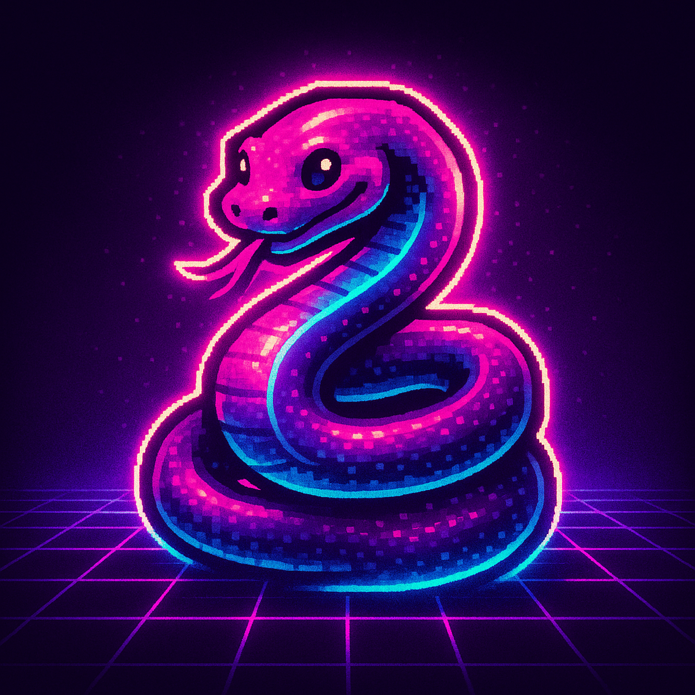

<h1 align="center">🐍 Slither.py</h1>
<p align="center">
  <b>The Ultimate Synthwave Snake Game</b><br>
  <i>Retro vibes. Neon grids. Modern Python.</i>
</p>

<p align="center">
  
</p>

<p align="center">
  <a href="https://github.com/vmaritato/slither-py/blob/master/LICENSE">
    
  </a>
  <a href="https://pypi.org/project/slither-py/">
    
  </a>
  <a href="https://github.com/vmaritato/slither-py/stargazers">
    
  </a>
  
</p>

## ❓ Why Slither.py?

- **Unique Visuals:** Synthwave-inspired, with glowing effects and pixel-perfect animations.
- **Modern Python:** Built with best practices, Poetry, and type hints.
- **Fun to Play, Fun to Hack:** Easy to customize, extend, and remix.
- **Great for Learning:** Clean code, modular structure, and plenty of comments.
- **Community-Driven:** Open to contributions, ideas, and new features.

## 🚀 Features

- **Synthwave/Neon UI**: Neon grids, glowing snake, animated food, custom fonts.
- **Classic & Modern Gameplay**: Growth, collisions, scoring, persistent high score.
- **Sound Effects**: Customizable sounds for eating and collisions.
- **Menu, Pause, Game Over**: Professional navigation, modern UX, and visual feedback.
- **Progressive Difficulty**: The game speeds up as you improve.
- **Skin System**: 10+ modular skins (Synthwave, Classic, Matrix, Solarized, Halloween, Ocean, Ice, Fire, Forest, Pastel, Monochrome, Sunset) with live preview and selection in the menu.
- **AI Demo Mode**: Let the game play itself! Enter demo mode from the menu (press D) or after inactivity. Watch the AI snake in action.
- **Controller Support**: Play with keyboard or gamepad. D-Pad for movement/skin selection, A/X to start, B/O to exit, Start to pause.
- **Easy Customization**: Tweak colors, sounds, and fonts to your taste.
- **100% Open Source**: Clean, tested, and easily extensible codebase.

## 📦 Installation

**Requirements:**

- Python 3.10+
- [Poetry](https://python-poetry.org/) (recommended)

**Quick Start:**

```bash
git clone https://github.com/vmaritato/slither-py.git
cd slither-py
poetry install
poetry run slither play
```

## 🎮 Controls

| Key / Button          | Action                              |
| --------------------- | ----------------------------------- |
| Arrows / D-Pad        | Move the snake / Change skin (menu) |
| P                     | Pause/Resume                        |
| Enter / A/X           | Start/Restart                       |
| Esc / B/O             | Quit                                |
| Start (Controller)    | Pause/Resume                        |
| D (Menu)              | Enter AI Demo Mode                  |
| Any key/button (Demo) | Exit Demo Mode, return to menu      |

- **Controller support:** Plug-and-play with Xbox, PlayStation, and most USB/Bluetooth gamepads. Menu navigation and gameplay fully supported.

## 🛠️ Customization

- **Board Size & Grid:** The board now fills the entire window. To change the playfield size, edit `WIDTH`, `HEIGHT`, or `CELL_SIZE` in `slither/config.py`. The grid adapts automatically.
- **Colors & Style:** Tweak the synthwave palette or pick from 10+ skins in `slither/skins/`.
- **Sounds:** Replace files in `assets/sounds/` with your own effects.
- **Font:** Add a `.ttf` file as `assets/fonts/pixel_font.ttf` for a unique look.

## 🧪 Testing

```bash
poetry run pytest
```

## 💡 FAQ

**Q: How do I change the board or grid size?**  
A: Edit `WIDTH`, `HEIGHT`, or `CELL_SIZE` in `slither/config.py`. The board and grid will automatically adapt to the new window size.

**Q: How do I change the theme or colors?**  
A: Edit the color constants in `slither/config.py` or pick a different skin from the main menu.

**Q: Can I use my own sounds or fonts?**  
A: Absolutely! Just replace the files in `assets/sounds/` or add your font as `assets/fonts/pixel_font.ttf`.

**Q: Can I contribute new features?**  
A: Yes! Please open an issue or pull request. All contributions are welcome.

**Q: Does it work on Windows/Linux/Mac?**  
A: Yes, as long as you have Python 3.10+ and Pygame installed.

## 🤝 Contributing

Contributions, bug reports, and suggestions are welcome!  
See [CONTRIBUTING.md](CONTRIBUTING.md) for guidelines.

## 📄 License

This project is licensed under the MIT License.  
See [LICENSE](LICENSE) for details.

## 👨‍💻 Author

[Vincenzo Maritato](https://vmaritato.com/)  
Contact: <hello@vmaritato.com>

## ⭐️ Show Your Support!

If you like this project, please consider starring it on GitHub and sharing it with your friends!

<p align="center">
  
</p>
